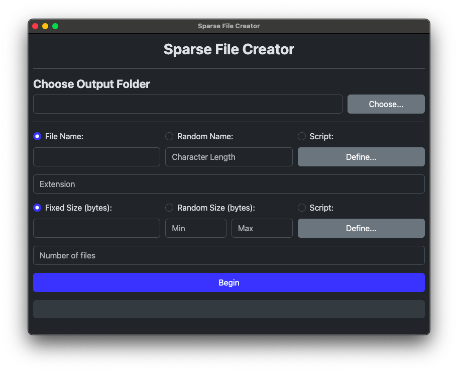

# sparse-file-creator



**sparse-file-creator** is a small application written in **NW.js** (which is basically HTML for front-end and Node.JS for back-end), and it can be used to make multiple sparse (dummy) files for testing or "entertainment" purposes (yes, I find using this tool a bit entertaining).

## Main Features

* Create (multiple) sparse file(s) based on the defined settings
* The file name and size can be randomized, or defined using JavaScript based on the current index (from 0 to length - 1)
* Blazing-fast file creation because of `fs.ftruncate()` (uses only one system call to create the sparse file (almost) instantly). Due to it being blazing-fast, you won't see the progress bar going up most of the time, although the progress bar actually exists.

## Supported systems

As soon as your operating system supports NW.js and your disk's filesystem supports `fs.ftruncate()`, this application will likely work. If it doesn't work, consider re-checking your file system. I've tested it on:

* **Arch Linux** with ext4 and NTFS filesystem
* **macOS** with APFS filesystem

## Installation

### Prebuilt binaries

[This is your destination](../../releases). Just download the binary made for your current operating system.

### "Building" from source

Since this application uses NW.js, the building process is very easy to perform:

#### Windows

NW.js 0.72.0 is recommended because of it being the latest version supporting Windows 7 and 8.1. If you're using Windows 10, you can indeed download the latest version instead of older ones.

I'm doing this using PowerShell command line, but of course, you can do all of these things with respective GUI applications if you want.

Replace `nwjs-v0.72.0-win-x64` in every command with `nwjs-v0.72.0-win-ia32` if you're building the 32-bit version.

1. Download NW.js binaries from the server:

**32-bit**

```shell
wget -O nwjs.zip https://dl.nwjs.io/v0.72.0/nwjs-v0.72.0-win-ia32.zip
```

**64-bit**

```shell
wget -O nwjs.zip https://dl.nwjs.io/v0.72.0/nwjs-v0.72.0-win-x64.zip
```

2. Extract the downloaded `.zip` file:

```shell
Expand-Archive -Path nwjs.zip -DestinationPath .
```

3. Clone this repository:

```shell
git clone https://github.com/lv3-himeme/sparse-file-creator.git
```

4. Copy the source code into the NW.js folder:
```shell
Copy-Item -Path ".\sparse-file-creator\*" -Destination ".\nwjs-v0.72.0-win-x64" -Recurse -Exclude ".git*"
```

5. (Optional) Rename `nw.exe` to `sparse-file-creator.exe`:
```shell
Rename-Item -Path ".\nwjs-v0.72.0-win-x64\nw.exe" -NewName "sparse-file-creator.exe"
```

Now you can run `sparse-file-creator.exe` (or `nw.exe` if you don't rename it) in `nwjs-v0.72.0-win-x64` folder. Of course you can rename or compress the folder if you want.

#### macOS

NW.js 0.72.0 is also recommended for this OS to bring back macOS 10.15 support. Of course you can still download the latest version if you don't care.

Replace `nwjs-v0-72.0-osx-x64` in every command with `nwjs-v0.95.0-osx-arm64` if you're building the arm64 (Apple Silicon) version.

1. Download NW.js binaries from the server:

```shell
wget -O nwjs.zip https://dl.nwjs.io/v0.72.0/nwjs-v0.72.0-osx-x64.zip
```

For `arm64` (Apple Silicon), you need to download the latest `arm64` version:

```shell
wget -O nwjs.zip https://dl.nwjs.io/v0.95.0/nwjs-v0.95.0-osx-arm64.zip
```

2. Extract the downloaded `.zip` file:

```shell
unzip -o nwjs.zip -d .
```

3. Create a new folder called `app.nw` in `nwjs.app/Contents/Resources`:

```shell
mkdir nwjs-v0.72.0-osx-x64/nwjs.app/Contents/Resources/app.nw
```

5. Clone this repository:

```shell
git clone https://github.com/lv3-himeme/sparse-file-creator.git
```

6. Copy the source code to NW.js folder:
```shell
rsync -av --exclude=".git*" sparse-file-creator/ nwjs-v0.72.0-osx-x64/nwjs.app/Contents/Resources/app.nw/
```

7. (Optional) Rename `nwjs.app` to `sparse-file-creator.app`:
```shell
mv nwjs-v0.72.0-osx-x64/nwjs.app nwjs-v0.72.0-osx-x64/sparse-file-creator.app
```

Now you can run `sparse-file-creator.app` (or `nwjs.app` if you don't rename it) in `nwjs-v0.72.0-osx-x64` folder, and of course you can rename or compress it if you want.

#### Linux

Replace `nwjs-v0.95.0-linux-x64` in every command with `nwjs-v0.95.0-linux-ia32` if you're building the 32-bit version.

1. Download the latest NW.js binaries:

**32-bit**

```shell
wget -O nwjs.tar.gz https://dl.nwjs.io/v0.95.0/nwjs-v0.95.0-linux-ia32.tar.gz
```

**64-bit**

```shell
wget -O nwjs.tar.gz https://dl.nwjs.io/v0.95.0/nwjs-v0.95.0-linux-x64.tar.gz
```

2. Extract the downloaded `.tar.gz` file:

```shell
tar -xzvf nwjs.tar.gz
```

3. Clone this repository:

```shell
git clone https://github.com/lv3-himeme/sparse-file-creator.git
```

4. Copy the source code to NW.js folder:
```shell
rsync -av --exclude=".git*" sparse-file-creator/ nwjs-v0.95.0-linux-x64/
```

5. Make the `nw` file executable:
```shell
chmod +x nwjs-v0.95.0-linux-x64/nw
```

6. (Optional) Rename `nw` to `sparse-file-creator` if you want:
```shell
mv nwjs-v0.95.0-linux-x64/nw nwjs-v0.95.0-linux-x64/sparse-file-creator
```

Now you can run `sparse-file-creator` (or `nw` if you don't rename it) in `nwjs-v0.95.0-linux-x64` folder, and of course you can rename or compress it if you want.

## Libraries used

* **Bootstrap** v5.3.3
* **jQuery** v3.7.1
* **CodeMirror** v5.65.18

You can view their respective license in the [licenses](/licenses/) folder.

## License

This application is licensed under [**MIT License**](/LICENSE).